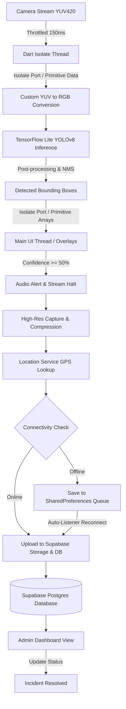

# Road Security Application: Comprehensive Technical & Architectural Report (A to Z)

This document provides an exhaustive, end-to-end technical analysis of the **Road Security** application. It details the system architecture, core technologies, custom real-time computer vision optimizations, synchronization pipelines, administrative workflows, and solutions to common compilation/runtime issues.

---

## 1. Executive Summary & Purpose

The **Road Security App** is an AI-powered mobile application designed to detect road hazards—specifically potholes—in real-time during travel. Developed using Flutter, Dart, and TensorFlow Lite, the application runs a custom-trained object detection model directly on the edge (device CPU/GPU) to ensure zero-latency detections and driver alerts, even in areas without cellular connectivity.

### Core Value Proposition:
1. **Real-time Edge AI:** Local inference guarantees immediate audio warnings ("Pothole detected"), giving drivers enough reaction time to navigate safely.
2. **Offline-First Synchronization:** Seamless storage of reports in local caches, auto-synchronizing with the server once connectivity is restored.
3. **Location Precision:** Precise coordinate extraction paired with fallback recovery.
4. **Centralized Incident Review:** An administrative portal to track, inspect, map, and resolve incidents.

---

## 2. High-Level System Architecture

The application is split into two primary components: the **Driver Client** and the **Administrative Dashboard**. Both interact with a cloud-based **Supabase PostgreSQL & Object Storage** backend.



### User Roles & Navigation Paths:
* **Driver / Standard User:** Authorized to access the real-time camera scanning feed. The interface overlays dynamic red bounding boxes when potholes are spotted.
* **Administrator:** Logs in to view a comprehensive dashboard of all hazards, filters status types, tracks confidence scores, loads interactive map links, and records repairs.

---

## 3. Technology Stack Breakdown (What & Why)

| Technology | Implementation Area | Architectural Justification ("Why") |
| :--- | :--- | :--- |
| **Flutter SDK (`>=3.3.0 <4.0.0`)** | App Core & UI | Enables native compilation for Android and iOS, high-performance UI overlays (60+ FPS), and access to raw camera byte-level image streams. |
| **TensorFlow Lite (`tflite_flutter`)** | On-Device AI | Facilitates ultra-low latency inference on the device. Prevents high server billing, network bandwidth wastage, and operates in zero-signal environments. |
| **YOLOv8 (`assets/best.tflite`)** | Object Detection | The state-of-the-art model for edge object detection. Balanced to handle dynamic shapes, fast-moving items, and multiple pothole clusters in a single frame. |
| **Supabase (`supabase_flutter`)** | Cloud Backend | An open-source SQL-based Firebase alternative. Postgres provides strong relational query capabilities for geographic reporting, and the storage buckets handle raw images efficiently. |
| **Geolocator (`geolocator`)** | Location Acquisition | Fetches high-precision GPS points. Includes strict timeouts and automatic fallbacks to last known coordinates in case of GPS dropouts. |
| **Image Compression (`flutter_image_compress`)** | Network Optimization | Compresses high-resolution camera captures to 640x640 at 50% JPEG quality before network transfer, speeding up upload durations by over 90%. |
| **SharedPreferences** | Offline Queue | Acts as a persistent local store for report payloads queue and paths to cached images during offline events. |
| **Flutter TTS (`flutter_tts`)** | Safety Notifications | Triggers immediate text-to-speech audio ("Pothole detected") so the driver remains focused on the road, minimizing driver distraction. |

---

## 4. Deep Dive: Edge AI & Inference Pipeline (`detection_service.dart`)

The real-time scanning loop is designed to minimize frame dropping and garbage collection pauses. 

### A. Non-Blocking Multithreaded Execution (Isolates)
Dart operates on a single-thread event loop. Performing heavy YUV-to-RGB conversion and executing neural network models on the main thread would freeze the UI and create camera feed jank.
* **Solution:** The [DetectionService](file:///d:/projects/Road_Security/road_security/lib/services/detection_service.dart) spawns a background **Dart Isolate** (`_isolateMain`).
* **Isolate Ports Optimization:** Passing complex Dart objects between isolates introduces heavy serialization and deserialization overhead. The service passes raw image planes (`Uint8List`) and dimensions to the Isolate, and the Isolate sends back only primitive lists (`List<List<double>>`) representing bounding boxes `[left, top, right, bottom, confidence]`.

### B. Garbage Collection (GC) Mitigation & Buffer Re-use
Allocating large arrays multiple times per second causes Dart's garbage collector to run frequently, introducing lag spikes (frame drops).
* **Pre-allocated Tensors:** On initialization, the Isolate allocates multidimensional arrays for input (`inputBuffer`) and output (`outputBuffer`) shapes only once.
* **Pre-computed Lookups:** Map indexes for scaling and rotation (`txToSx`, `tyToSy`, `tyToSxRot`, `txToSyRot`) are pre-calculated. Instead of calculating them on each pixel, the system uses lookup arrays.

### C. Raw YUV420 to RGB Conversion
Android cameras stream images in YUV420 format (NV21/YV12 layout). TFLite models require normalized RGB arrays. The Isolate runs a direct, highly-optimized bitwise conversion:
```dart
int r = (1192 * yPlane[yIdx] + 1634 * (vPlane[uvIdx] - 128)) >> 10;
int g = (1192 * yPlane[yIdx] - 400 * (uPlane[uvIdx] - 128) - 833 * (vPlane[uvIdx] - 128)) >> 10;
int b = (1192 * yPlane[yIdx] + 2066 * (uPlane[uvIdx] - 128)) >> 10;
```
It supports both layout formats (NCHW/NHWC) and model types (Floating point normalized to `0.0 - 1.0` or raw integers `0 - 255`).

### D. YOLOv8 Output Parsing & NMS
The TFLite model evaluates 8,400 candidate bounding boxes. 
1. **Dequantization:** If the loaded model is INT8 quantized, values are decoded using scale and zero-point parameters: `val = (val - zeroPoint) * scale`.
2. **Filtering:** Detections with class confidence scores below `0.45` are ignored.
3. **Non-Maximum Suppression (NMS):** Overlapping bounding boxes targeting the same pothole are combined. Boxes are sorted by confidence and filtered out using Intersection-over-Union (IoU) with a threshold of `0.45`:
   $$\text{IoU} = \frac{\text{Area of Intersection}}{\text{Area of Union}}$$

---

## 5. Deep Dive: Offline-First Synchronization Architecture

The synchronization system guarantees that no pothole location goes unreported, regardless of cellular service coverage.

```
       [ Pothole Detected ]
                │
         [ Capture Photo ]
                │
         [ Get GPS Coords ]
                │
         [ Connectivity? ]
          /           \
     (Online)       (Offline)
       /                 \
[Direct Upload]     [Queue Locally]
     /                     \
[Supabase]         [Listen Connectivity]
                            │
                    [Sync when Online]
                            │
                     [Delete Cache]
```

### How the Offline Queue Operates (`offline_service.dart`):
1. **Local Enqueuing:** If connectivity is missing or the upload fails, the report is saved with a status of `pending`. The raw image is saved to the app's temporary folder, and the metadata plus the local image path is converted to a JSON string and appended to `SharedPreferences` under the key `offline_queue`.
2. **Dynamic Connection Listening:** The [CameraScreen](file:///d:/projects/Road_Security/road_security/lib/screens/camera_screen.dart) maintains a stream listener (`Connectivity().onConnectivityChanged`).
3. **Automatic Synchronization:** When the connection status changes back to online, the app pauses the detection loop, processes the queue item-by-item:
   - Uploads the locally cached image file to Supabase.
   - Retrieves the public URL of the uploaded image.
   - Updates the database row in the `hazards` table.
   - Deletes the local temporary image file to free device storage.
   - Removes the synced report from the `SharedPreferences` queue.
4. **Resuming Scanning:** Once the queue is clear, the real-time detection loops automatically resume.

---

## 6. End-to-End Code Walkthrough

### 1. Entry Point ([main.dart](file:///d:/projects/Road_Security/road_security/lib/main.dart))
* Checks camera hardware availability.
* Initializes Supabase with project URL and anonymized public key.
* Boots the app into the `LoginScreen`.

### 2. Multi-Role Authentication Screen ([login_screen.dart](file:///d:/projects/Road_Security/road_security/lib/screens/login_screen.dart))
* Allows signing up and signing in via email.
* Performs role segregation:
  * Emails containing `'admin'` bypass the scanner and load the `AdminDashboard`.
  * Other emails open the `CameraScreen`.

### 3. Real-Time Camera Interface ([camera_screen.dart](file:///d:/projects/Road_Security/road_security/lib/screens/camera_screen.dart))
* Spawns the camera stream using `ResolutionPreset.medium`.
* Applies a temporal throttle: Frames are fed to the model at most once every `150ms` (approx. 7 FPS) to save battery and processing resources.
* Halts the image stream during a positive detection to avoid camera hardware resource deadlocks.
* Paints bounding boxes using a `CustomPainter` class (`BoundingBoxPainter`).

### 4. Geolocator Integration ([location_service.dart](file:///d:/projects/Road_Security/road_security/lib/services/location_service.dart))
* Checks system permissions and location service availability.
* Requests location using `desiredAccuracy: LocationAccuracy.best`.
* Applies a `15-second` timeout. If GPS fails (e.g. inside tunnels), it falls back to the last known position.
* Formats coordinates into Google Maps links: `https://www.google.com/maps?q=latitude,longitude`.

### 5. Administrative Dashboard ([admin_dashboard.dart](file:///d:/projects/Road_Security/road_security/lib/screens/admin_dashboard.dart) & [hazard_card.dart](file:///d:/projects/Road_Security/road_security/lib/widgets/hazard_card.dart))
* Fetches hazard reports sorted by creation timestamp (most recent first).
* Categorizes confidence scores into four levels:
  * **Critical:** Confidence > 90% (Red)
  * **High:** Confidence > 80% (Orange)
  * **Medium:** Confidence > 70% (Amber)
  * **Low:** Confidence <= 70% (Green)
* Connects the maps link to the system browser or native mapping application.
* Provides a "Solve" button to update status fields in Supabase to `solved`.

---

## 7. Database & Platform Configuration Setup

### A. Supabase Database Schema
Set up the `hazards` table in PostgreSQL:
```sql
CREATE TABLE public.hazards (
    id UUID DEFAULT gen_random_uuid() PRIMARY KEY,
    created_at TIMESTAMP WITH TIME ZONE DEFAULT timezone('utc'::text, now()) NOT NULL,
    latitude DOUBLE PRECISION NOT NULL,
    longitude DOUBLE PRECISION NOT NULL,
    confidence DOUBLE PRECISION NOT NULL,
    maps_link TEXT NOT NULL,
    image_url TEXT NOT NULL,
    status TEXT DEFAULT 'pending'::text NOT NULL
);
```
Create a public storage bucket named `potholes` in Supabase Storage with Row Level Security (RLS) rules permitting anonymous inserts and public reads.

### B. Android Platform Permissions (`android/app/src/main/AndroidManifest.xml`)
The following declarations are configured for camera, GPS, and connectivity states:
```xml
<uses-permission android:name="android.permission.INTERNET"/>
<uses-permission android:name="android.permission.CAMERA"/>
<uses-feature android:name="android.hardware.camera"/>
<uses-permission android:name="android.permission.ACCESS_FINE_LOCATION"/>
<uses-permission android:name="android.permission.ACCESS_COARSE_LOCATION"/>
<uses-permission android:name="android.permission.ACCESS_NETWORK_STATE"/>
```
Also includes package-visibility query intents to launch maps:
```xml
<queries>
    <intent>
        <action android:name="android.intent.action.VIEW" />
        <data android:scheme="https" />
    </intent>
</queries>
```

### C. Replacing the ML Model
To update or swap the detection model:
1. Export a YOLO model to TFLite format (input shape: `640x640`).
2. Save the model in the project directory as `assets/best.tflite`.
3. Check `pubspec.yaml` to ensure the asset directory is registered:
   ```yaml
   flutter:
     assets:
       - assets/
   ```

---

## 8. Summary of Performance Features & Optimization Tricks

* **Separated Heaps:** Use of Dart Isolates prevents heavy computing from locking the main UI thread.
* **Pre-calculated Mapping:** Multi-dimensional arrays are allocated once on initialization, minimizing GC work.
* **Double Strides & Rotations:** Coordinate translation indices are pre-mapped for fast scaling.
* **Throttle Limits:** A frame cooldown prevents CPU overheating and battery drain.
* **Stream Halting:** Halting the low-res camera stream during photo capture prevents camera hardware conflicts.
* **Dynamic Geocoding Timeouts:** A 15-second geolocation limit avoids endless waiting loops when GPS signal is weak.

---

## 9. Known Compilation & Runtime Issues

### A. Gradle Build Failure: `UnmodifiableUint8ListView`
When building the project on newer versions of Flutter and Dart, the build may fail with the following compilation error:
```
/C:/Users/kavid/AppData/Local/Pub/Cache/hosted/pub.dev/tflite_flutter-0.10.4/lib/src/tensor.dart:58:12: Error: The method 'UnmodifiableUint8ListView' isn't defined for the type 'Tensor'.
```

#### Why it occurs:
In modern Dart SDK versions, the `UnmodifiableUint8ListView` class was relocated or restricted in usage. Older versions of the `tflite_flutter` package (such as `0.10.4`) utilized this class directly in a way that is incompatible with the updated Dart SDK included with recent Flutter releases.

#### Resolution:
1. **Force Package Resolution Upgrade:** Update `pubspec.yaml` to target the latest release:
   ```yaml
   dependencies:
     tflite_flutter: ^0.11.0
   ```
2. **Clear Build Caches:** Run the following commands in the terminal to remove stale files and fetch updated packages:
   ```bash
   flutter clean
   flutter pub get
   ```
3. **Use Dependency Overrides:** If transitively pinned, add the following override block at the end of `pubspec.yaml`:
   ```yaml
   dependency_overrides:
     tflite_flutter: 0.11.0
   ```

### B. Lint Warnings & Deprecations
The codebase contains a few minor lint and deprecation warnings:
1. **`withOpacity` Deprecation:** In Flutter SDK v3.22+, `withOpacity` is deprecated. Use `withValues(alpha: ...)` or `.withAlpha(...)` to avoid precision loss.
2. **`BuildContext` Async Gap warning:** In `hazard_card.dart` inside `_markSolved`, showing a `SnackBar` using the raw `context` after an `await` triggers a lint warning because the widget might be unmounted.
   * **Fix:** Check `if (context.mounted)` before accessing the context, or pass a scaffold messenger key/reference.
3. **`path` Import warning:** `SupabaseService` and `ImageUtils` import `package:path/path.dart` but it is not listed as a direct dependency in `pubspec.yaml`.
   * **Fix:** Add `path: ^1.9.1` to the dependencies section in `pubspec.yaml`.
